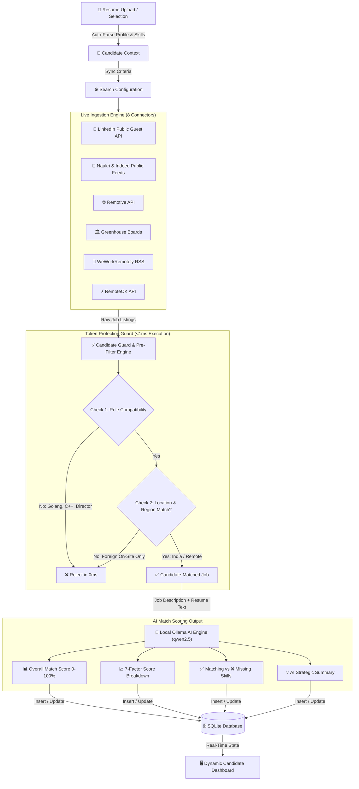
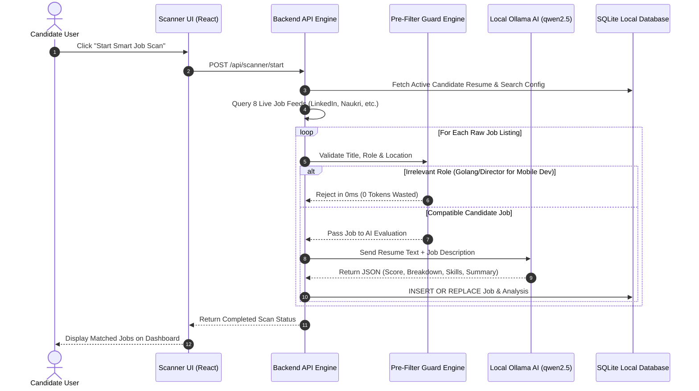
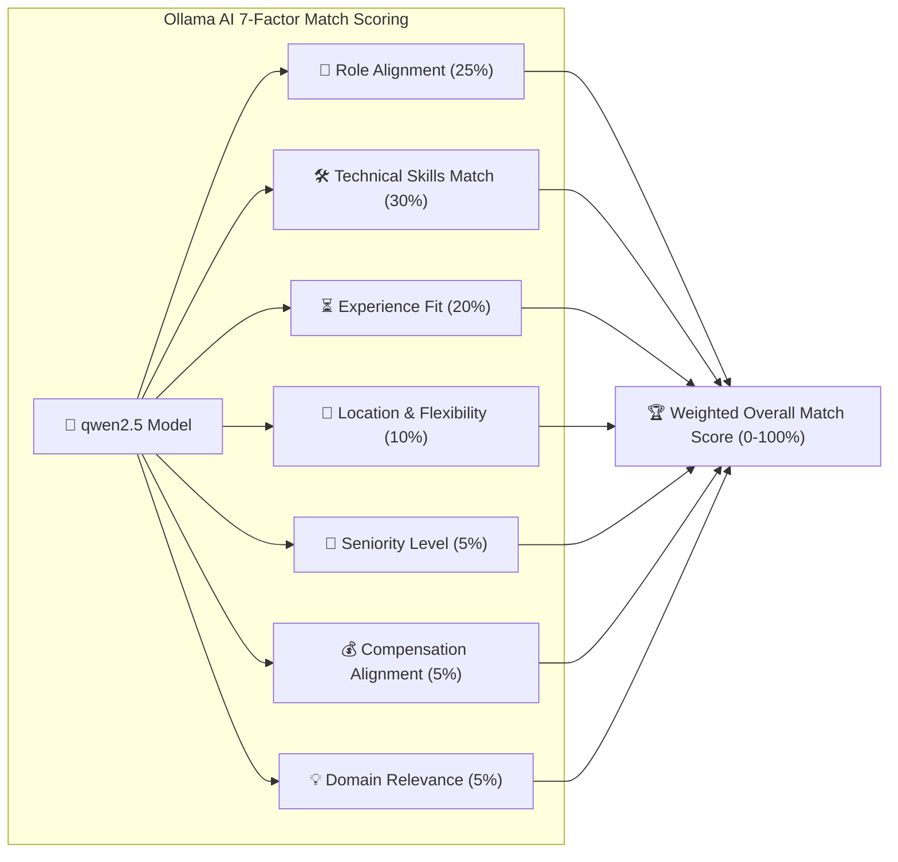

# 🤖 AI Job Finder & Matching Architecture Guide

This document provides a comprehensive visual diagram and architectural breakdown of the system workflow, live job ingestion pipeline, candidate pre-filtering engine, local Ollama AI scoring mechanism, and database structure of **AI Job Finder**.

---

## 📐 1. End-to-End System Architecture & Pipeline

---

## ⏱️ 2. Step-by-Step Execution Sequence Diagram

---

## 🧠 3. Local Ollama AI 7-Factor Match Scoring Matrix

---

## ⚡ 4. Supported Live Ingestion Connectors (8 Feeds)

| Job Source Name | Coverage / Region | Integration Type & URL | Status |
| :--- | :--- | :--- | :--- |
| **LinkedIn Jobs** | India & Global | Direct Public Guest Search API (Official Apply Links) | `LIVE ACTIVE` |
| **Naukri & Indeed Public** | India Tech Hubs | Live Indian Developer Feeds (Ahmedabad, Bengaluru, Pune, Delhi) | `LIVE ACTIVE` |
| **India & Local Public Jobs** | India Regional | Software, Mobile & Full-Stack Regional Feeds | `LIVE ACTIVE` |
| **WeWorkRemotely RSS** | Global Remote | Back-End, Full-Stack, Front-End RSS Feeds | `LIVE ACTIVE` |
| **Remotive Public API** | Global Remote | Live Engineering & Mobile API Endpoint | `LIVE ACTIVE` |
| **Greenhouse Career Boards** | Company Boards | Direct queries for GitLab, Zapier, Elastic, Figma | `LIVE ACTIVE` |
| **RemoteOK Public API** | Global Remote | Dynamic Keyword Tag Search Endpoint | `LIVE ACTIVE` |
| **Jobicy Public API** | Global Public | Engineering Category API Endpoint | `LIVE ACTIVE` |
